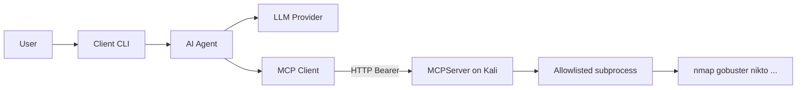

# Kali-MCP

Python **MCP server** (runs on Kali Linux) and **MCP client** (AI agent with a configurable LLM) for authorized penetration testing and DAST workflows.

```
User ──► Client (LLM agent) ──Streamable HTTP──► Server (Kali tools, no LLM)
```

| Component | Role | LLM? |
|-----------|------|------|
| [`server/`](server/) | Exposes Kali tools over MCP Streamable HTTP | No |
| [`client/`](client/) | Chat agent that calls those tools via MCP | Yes (Anthropic / OpenAI / Gemini / Mistral / Ollama) |

## Tools exposed by the server

- Dirb, enum4linux, gobuster, Hydra, John the Ripper, Metasploit Framework, Nikto, Nmap, sqlmap, WPScan
- Optional raw shell via `run_command` (disabled unless `ALLOW_RAW=true`)

## Authorized use only

**Use this software only against systems you own or have explicit written permission to test.** Unauthorized access to computer systems is illegal. You are solely responsible for complying with applicable laws and your engagement scope. The maintainers assume no liability for misuse.

## Quick start

### 1. Server (on Kali)

```bash
cd server
python -m venv .venv
source .venv/bin/activate
pip install -r requirements.txt
cp .env.example .env   # set MCP_AUTH_TOKEN
python -m kali_mcp_server
```

Listens at `http://0.0.0.0:8000/mcp` by default. Install the Kali packages for the tools you need (nmap, gobuster, etc.); the server wraps them, it does not install them.

### 2. Client (any machine)

```bash
cd client
python -m venv .venv
# Windows: .venv\Scripts\activate
source .venv/bin/activate
pip install -r requirements.txt
cp .env.example .env
# Set MCP_SERVER_URL, MCP_AUTH_TOKEN (same as server), LLM_PROVIDER, API key / Ollama
python -m kali_mcp_client
```

## Architecture



## Security notes

- Bearer token auth when `MCP_AUTH_TOKEN` is set (recommended).
- Streamable HTTP Host-header checks: set `MCP_ALLOWED_HOSTS` on the server (LAN/WSL IP) or leave it empty with `MCP_HOST=0.0.0.0` so DNS-rebinding protection does not reject those clients with HTTP 421.
- Structured tools use argv subprocess (no shell); binary allowlist + timeouts.
- No TLS in-process — put the server behind a VPN or reverse proxy with TLS for real deployments.
- Raw shell is opt-in (`ALLOW_RAW`).

See [`server/README.md`](server/README.md) and [`client/README.md`](client/README.md) for details.
