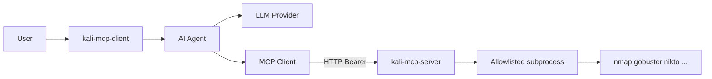

<p align="center">
  
  
  
  
</p>

<h1 align="center">Kali-MCP</h1>

<p align="center">
  <b>AI-driven penetration testing over the Model Context Protocol</b><br/>
  Run Kali tools from an LLM agent — securely, over the network, with allowlisted binaries.
</p>

<p align="center">
  <a href="#quick-start">Quick start</a> ·
  <a href="#architecture">Architecture</a> ·
  <a href="#tools">Tools</a> ·
  <a href="#security">Security</a> ·
  <a href="#contact">Contact</a>
</p>

---

```
┌─────────────┐     Streamable HTTP + Bearer      ┌──────────────────────┐
│  LLM Agent  │ ────────────────────────────────► │  Kali MCP Server     │
│  (client)   │     nmap · gobuster · nikto …     │  (no LLM on box)     │
└─────────────┘                                   └──────────────────────┘
```

| Package | Where it runs | What it does | LLM? |
|---------|---------------|--------------|------|
| [`server/`](server/) | Kali Linux | Exposes pentest tools as MCP tools | No |
| [`client/`](client/) | Any machine | Chat agent that calls those tools | Yes — Anthropic / OpenAI / Gemini / Mistral / Ollama |

> **Authorized use only.** Test systems you own or have **written permission** to assess. Unauthorized access is illegal. You are responsible for scope and compliance. See [SECURITY.md](SECURITY.md).

## Why Kali-MCP?

- **Split brain** — heavy tools stay on Kali; the LLM stays on your laptop or API
- **Real MCP** — Streamable HTTP transport, Bearer auth, Host-header controls
- **Safe by default** — argv subprocess (no shell), binary allowlist, timeouts; raw shell is opt-in
- **Provider flexible** — Anthropic, OpenAI, Gemini, Mistral, or local Ollama
- **Proper packages** — install with `pip install -e .` and run `kali-mcp-server` / `kali-mcp-client`

## Quick start

### 1. Server (on Kali)

```bash
git clone https://github.com/captainnarwal/Kali-MCP.git
cd Kali-MCP/server

sudo apt update
sudo apt install -y \
  python3 python3-venv python3-pip git \
  nmap dirb gobuster nikto enum4linux wpscan \
  sqlmap hydra john metasploit-framework

python3 -m venv .venv
source .venv/bin/activate
pip install -U pip
pip install -e .

cp .env.example .env   # set a strong MCP_AUTH_TOKEN
kali-mcp-server
# equivalent: python -m kali_mcp_server
```

Listens at `http://0.0.0.0:8000/mcp` by default. The server **wraps** Kali packages; it does not install them.

Full walkthrough: [`server/README.md`](server/README.md)

### 2. Client (any machine)

```bash
cd Kali-MCP/client
python3 -m venv .venv
# Windows: .venv\Scripts\activate
source .venv/bin/activate
pip install -U pip
pip install -e .

cp .env.example .env
# Set MCP_SERVER_URL, MCP_AUTH_TOKEN, LLM_PROVIDER, and your API key (or Ollama)

kali-mcp-client
# equivalent: python -m kali_mcp_client
```

Details & REPL commands: [`client/README.md`](client/README.md)

## Architecture



## Tools

| Tool | Binary |
|------|--------|
| `nmap_scan` | nmap |
| `dirb_scan` | dirb |
| `gobuster_scan` | gobuster |
| `nikto_scan` | nikto |
| `enum4linux_scan` | enum4linux |
| `wpscan_scan` | wpscan |
| `sqlmap_scan` | sqlmap |
| `hydra_attack` | hydra |
| `john_crack` | john |
| `metasploit_run` | msfconsole |
| `server_status` | — |
| `run_command` | raw shell — **off** unless `ALLOW_RAW=true` |

## Security

- Bearer token when `MCP_AUTH_TOKEN` is set (**recommended**)
- Host-header checks via `MCP_ALLOWED_HOSTS` (or empty + `MCP_HOST=0.0.0.0` for LAN/WSL)
- Structured tools: argv only, allowlist, timeouts
- No in-process TLS — put the server behind VPN or a TLS reverse proxy for real deployments
- Raw shell is opt-in (`ALLOW_RAW`)

More: [SECURITY.md](SECURITY.md)

## Project layout

```
Kali-MCP/
├── server/          # kali-mcp-server package (pyproject.toml)
├── client/          # kali-mcp-client package (pyproject.toml)
├── LICENSE          # MIT
├── SECURITY.md
└── README.md
```

## Contact

**Neeraj Narwal** — [neerajnarwal2000@gmail.com](mailto:neerajnarwal2000@gmail.com)

- Issues & ideas: [GitHub Issues](https://github.com/captainnarwal/Kali-MCP/issues)
- Security reports: email first (see [SECURITY.md](SECURITY.md))

## License

[MIT](LICENSE) © 2026 Neeraj Narwal
